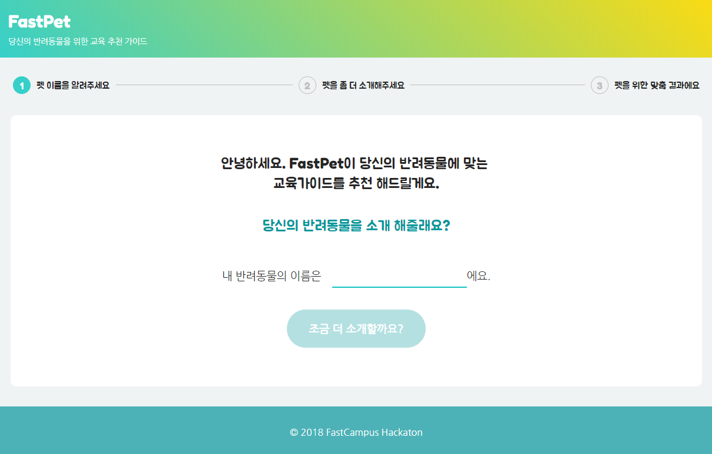

# FastPet

> 패스트캠퍼스 해커톤에서 진행한 프로젝트 사이트입니다.  
> 서비스는 https://fastpet.netlify.com 에서 확인하실 수 있습니다.

## 프로젝트 목표

> 당신의 반려동물을 위한 교육 추천 가이드를 받으세요.

반려동물의 이름/종/품종/성별/나이 자가진단을 통한 체형정보와 부가적으로 원하는 사료 기능정보/이상행동 정보를 받아 맞춤 가이드와 추천 교육 정보를 제공한다.

## 서비스 기능

### 1. 반려동물 이름 입력 페이지

- 이름 정보를 입력받아 진행하도록 한다.

### 2. 반려동물 정보 입력 페이지

- 입력된 이름 정보를 통해 친근하게 말을 거는 것 같은 서비스 제공한다.
- 입력받은 반려동물의 종에 따라 선택적으로 품종 옵션과 체형 자가진단을 제공한다.
- 반려동물의 기본 정보(종/품종/성별/나이/체형정보)를 입력받으면 다음단계로 넘어갈 수 있는 버튼과 부가 정보 입력 화면을 제공한다.
- 부가정보는 관련 태그를 버튼으로 제공하여 선택하거나 선택을 취소할 수 있도록 한다.
- 부가정보를 받지 않음을 선택할 경우 모든 선택된 버튼이 해제되며 버튼이 disabled 처리가 되도록 한다.

### 3. 결과(가이드) 제공 페이지

- 입력된 정보를 토대로 가이드를 제공한다.
- 기본 입력 정보만 받았을 경우 기본 입력 정보 중 품종/나이/체형정보에 따른 기본 가이드 내용과 관련된 추천 교육자료를 캐러셀로 제공한다.
- 부가 정보를 받았을 경우 사료는 추천 사료를 캐러셀로 제공해 클릭시 제휴 몰로 새창을 띄워 이동할 수 있도록한다.
- 부가 정보 중 이상행동 가이드를 받았을 경우 이상행동에 대한 가이를 카드형태의 캐러셀로 제공한다.

### 4. 콘텐츠 뷰 페이지

- 교육자료 카드를 클릭시 해당 콘텐츠 뷰 페이지로 이동한다.
- 타이틀 / 교육 영상 / 디스크립션과 이전 가이드 페이지로 이동할 수 있는 버튼을 제공한다.

## 개발 기간

18.07.10 ~ 18.07.12(3 일)

## 기술 스택 & 툴

### 기획

- Axure: 와이어프레임

### Front-end

- react
- react-router
- bulma

## 환경

- create-react-app 환경 빌드
- netlify 를 통한 웹사이트 배포

## 팀원

### 기획

- 백혜원외 1 인

### 개발

- [김상혁(xxsank)](https://github.com/xxsank)
- [박치혜(chiabi)](https://github.com/chiabi)

## 협업

- Git, github
- Slack
- Axure
